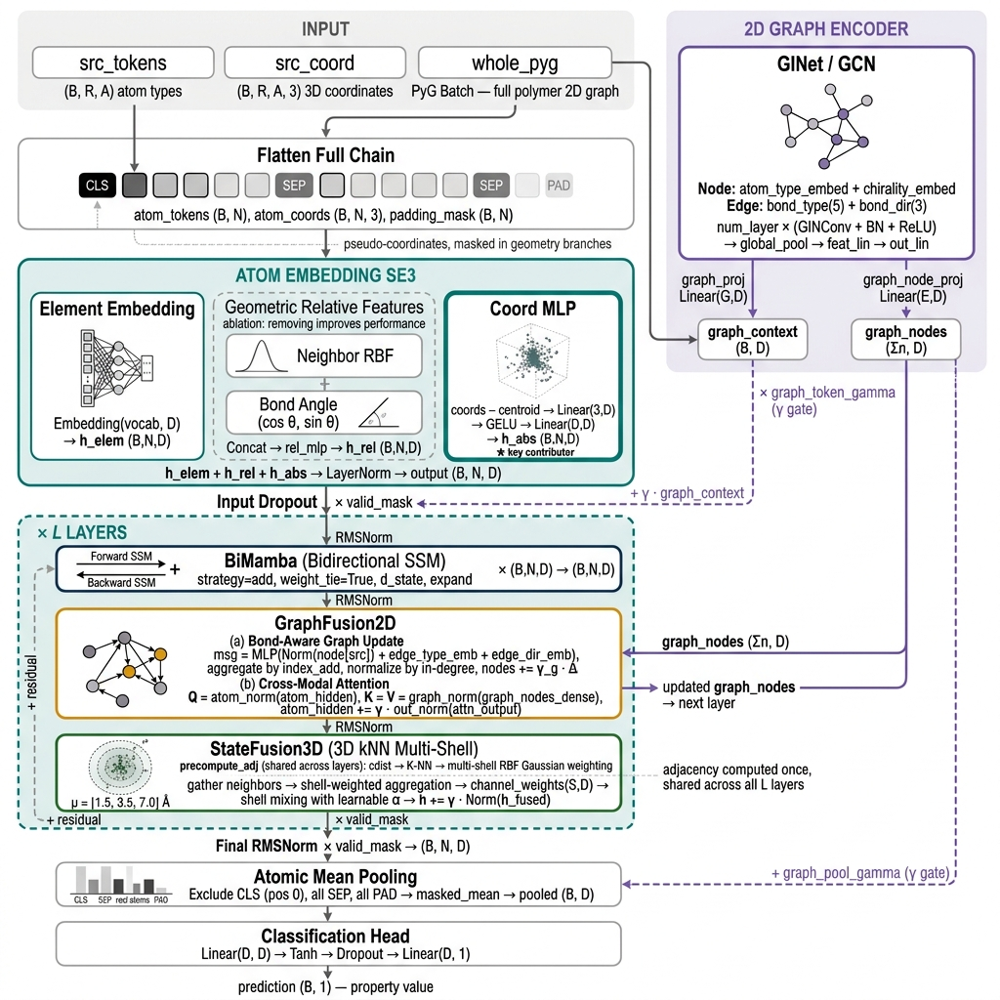
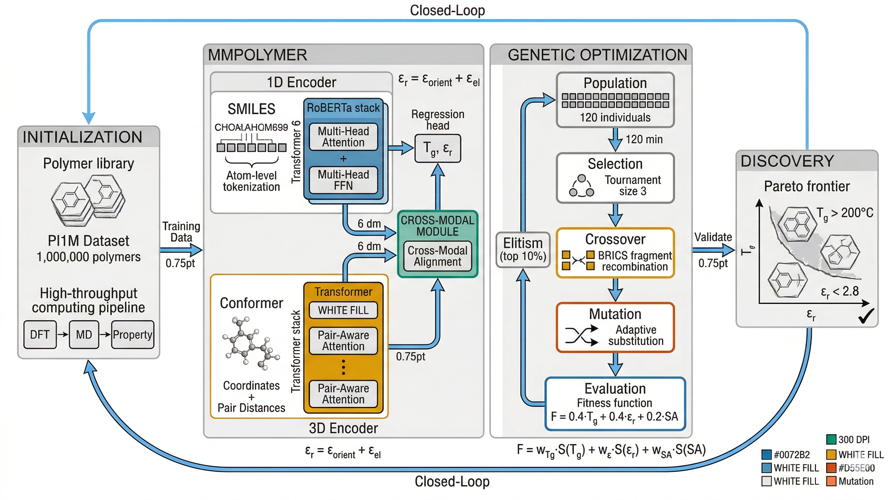
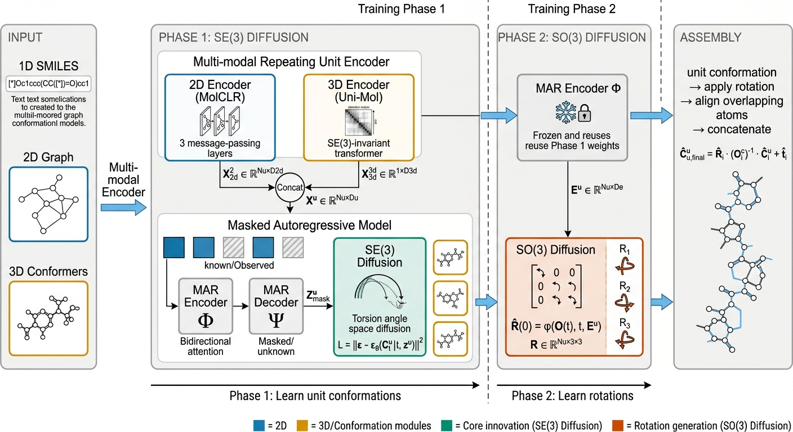

# Academic Figure Skills


AI 驱动的学术论文配图技能包，适用于 Claude Code / Gemini CLI / Cursor 等 AI 编程助手。从代码仓库分析到论文配图规划，再到高质量提示词生成。

## 快速开始（30 秒上手）

1. **安装**：`npx skills add Azhi-ss/academic-figure-skills`
2. **分析仓库**："帮我分析这个 ML 代码仓库"
3. **生成配图**："用 Okabe-Ito 配色，生成总体框架图提示词"

## 示例配图

以下为使用本技能包生成提示词后创建的学术配图示例：

<table>
<tr>
<td align="center" width="33%">

<br/><sub><b>Claude Opus 4.6 提示词 + Gemini NanoBanana2Flash</b></sub>
</td>
<td align="center" width="33%">

<br/><sub><b>豆包 2.0 Pro 提示词 + Gemini NanoBanana2Flash</b></sub>
</td>
<td align="center" width="33%">

<br/><sub><b>GLM-5 提示词 + Gemini NanoBanana2Flash</b></sub>
</td>
</tr>
</table>

## 技能列表

| 技能 | 功能 | 触发词 |
|-----|------|--------|
| **academic-figure-workflow** | 总入口工作流编排：判断从 repo / paper / prompt / color 哪一步开始，并自动路由到合适 skill | "帮我从仓库到配图走一遍"、"完整论文配图工作流"、"which skill should I use first" |
| **academic-repo-analyzer** | 分析 ML/DL 代码仓库，识别任务类型、模型架构、技术栈 | "分析代码仓库"、"仓库分析"、"repo analyzer" |
| **academic-figure-paper-analyzer** | 分析论文内容，规划需要的配图类型和数量 | "分析论文配图需求"、"论文需要哪些图"、"paper figure planning" |
| **academic-figure-color-expert** | 9 套预设配色方案，含色盲友好设计原则 | "学术配图配色"、"论文配色方案"、"academic color palette" |
| **academic-figure-prompt** | 经典风格（Okabe-Ito / Nature / CVPR）提示词生成 | "论文配图提示词"、"生成论文配图"、"paper figure prompt" |
| **academic-figure-prompt-pastel** | 现代 ML 风格（ICLR / NeurIPS 2024-2025）提示词 | "pastel风格论文配图"、"现代ML论文配图"、"modern ML figure prompt" |
| **academic-skill-eval-team** | 用多代理团队测评单个 skill 或整个 skill pack | "测评这个skill"、"评估这个skill pack"、"benchmark my skill" |

## 完整工作流

```
用户请求 → academic-figure-workflow（判断入口）
                                   ↓
             repo-analyzer / paper-analyzer / color-expert / figure-prompt
                                   ↓
                        结构化 handoff artifact
                                   ↓
                           最终英文配图提示词
                                   ↓
                         NanoBanana/Gemini → 配图
```

如果你不知道该先用哪个 skill，可以直接说：

- `帮我从仓库到配图走一遍`
- `完整论文配图工作流`
- `which skill should I use first`

总入口 skill 会先判断你当前处于哪一步，再只调用必要的下游 skill，而不是把整套流程强行跑完。

## Skill 测评

如果你想在发布前检查单个 skill 或整个 skill pack，可以直接说：

- `创建一个agent team测评一下我的这个skill`
- `评估这个skill pack的触发词、流程设计和输出质量`
- `benchmark my skill before release`

测评团队会从触发词、流程完整性、输出可用性、鲁棒性和整包一致性几个维度给出结构化报告。

## 安装

### 方式 1：npx skills（推荐）

```bash
npx skills add Azhi-ss/academic-figure-skills
```

### 方式 2：手动安装

```bash
git clone https://github.com/Azhi-ss/academic-figure-skills.git

# Claude Code
cp -r academic-figure-skills/* ~/.claude/skills/

# Gemini CLI
cp -r academic-figure-skills/* ~/.gemini/skills/
```

## 使用示例

```
# Step 1: 分析代码仓库
You: 帮我分析这个 ML 代码仓库
AI:  [扫描文件 → 识别任务类型 → 提取技术栈 → 生成快速理解文档]

# Step 2: 规划论文配图
You: 基于这份文档，帮我规划论文配图
AI:  [分析内容 → 识别关键章节 → 输出配图规划报告]

# Step 3: 选择配色方案
You: 我要投 NeurIPS，推荐什么配色？
AI:  [推荐 ML TopConf 方案 → 展示色值 → 说明适用场景]

# Step 4: 生成配图提示词
You: 用 Okabe-Ito 配色，帮我画一个总体框架图
AI:  [生成极其详细的英文提示词，包含布局、色值、标注、风格规格]
```

## 配色方案（9 套）

| 方案 | 适用场景 |
|-----|---------|
| Okabe-Ito | CVPR / NeurIPS / Nature，色盲友好 ⭐ |
| Blue Monochrome | 单色系期刊，灰度打印兼容 |
| Warm Earth | 生物学、医学影像 |
| Purple-Green | 数据可视化、IEEE 期刊 |
| Grayscale | 仅黑白打印 |
| Teal-Coral | HCI / CHI 现代感 |
| ML TopConf Tab10 | Matplotlib 默认，熟悉感强 |
| ML TopConf Colorblind | Seaborn 色盲友好 |
| ML TopConf Deep | 多面板消融图 |

## 📚 文档与资源

| 文档 | 说明 |
|-----|------|
| **[CHANGELOG.md](CHANGELOG.md)** | 版本历史记录 |
| **[CONTRIBUTING.md](CONTRIBUTING.md)** | 贡献指南 |
| **[docs/academic-references.md](docs/academic-references.md)** | 学术引用与权威参考文献 |
| **[docs/best-practices.md](docs/best-practices.md)** | 2024-2025 顶会配图最佳实践 |
| **[examples/](examples/)** | 完整端到端工作流示例 |

## 常见问题 FAQ

### Q: 生成的提示词是英文还是中文？
A: 提示词本身是英文（因为 AI 图片工具对英文理解更好），但说明文字是中文。

### Q: 支持哪些 AI 图片生成工具？
A: 提示词兼容 NanoBanana、Gemini、DALL-E、Midjourney 等主流工具。

### Q: 生成的图不满意怎么办？
A: 可以用"图生图"功能，在已有图的基础上用文字指令修改。

### Q: figure-prompt 要求先选配色，我不确定选哪个怎么办？
A: 如果你没指定配色，系统会先按“用户指定 → 场景推荐 → 默认安全方案”决策：能识别投稿 venue、学科或图类型时，优先推荐更合适的方案；如果信息不足，则会明确说明先用默认 `Okabe-Ito` 继续，后续也可以随时切换。

### Q: 可以只使用其中一个技能吗？
A: 当然可以！每个技能都是独立的，你可以只使用 figure-prompt 直接生成提示词。

### Q: 这些技能必须按顺序使用吗？
A: 不需要！每个技能都是完全独立的。你可以：
- 只使用 figure-prompt 直接生成提示词
- 只使用 color-expert 选择配色
- 只使用 repo-analyzer 理解代码仓库
- 或者按完整工作流使用所有技能

## 许可证

MIT License


## 致谢

本项目受到 [LINUX DO](https://linux.do/) 社区的启发和支持。
