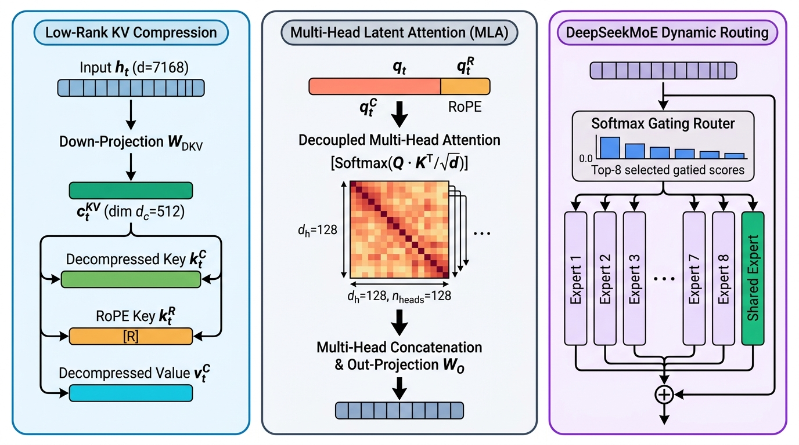
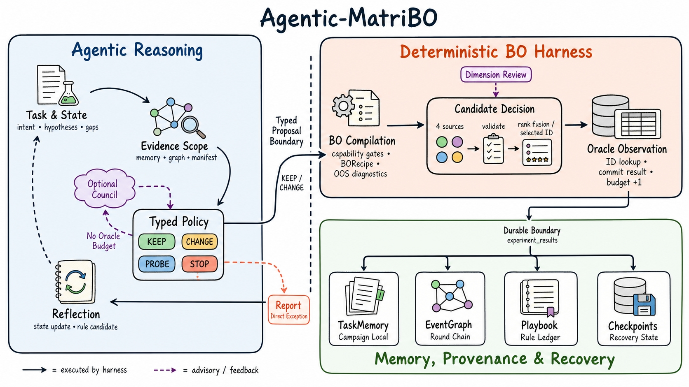
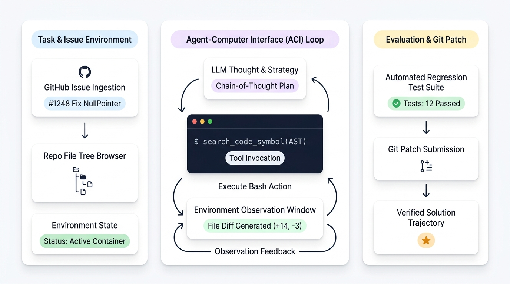
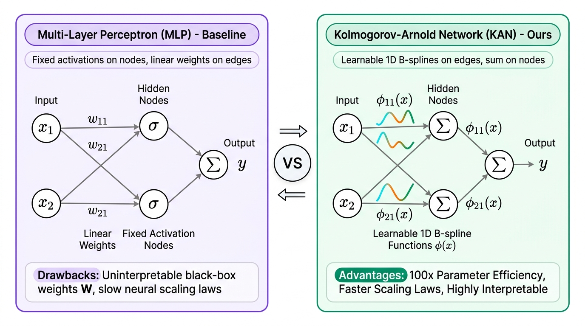
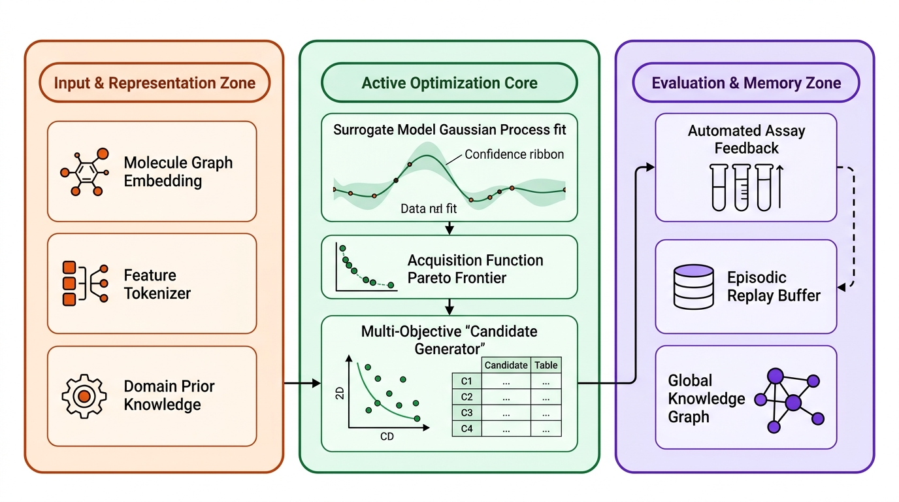

# Academic Figure Skills


**Academic paper figure skills for Claude Code, Cursor, Codex & Gemini CLI.**  
AI 驱动的学术论文配图技能包：证据分析 → FigurePlan v1 → FigureSpec v1 → 原生生图 → RenderAudit v1 → 定向修图。

> **是什么？** 6 个可独立安装的 agent skill，覆盖仓库/论文/参考图分析、可追溯配图规划、结构化规范、Codex 原生直接生图和生成后视觉审计。skill 定义可复用流程，不等于常驻子智能体；仅端到端 workflow 会在任务可独立拆分时临时派发 figure worker。三个 surface profile 是 `modern-technical-vector`、`pastel-airy-ui`、`illustrated-modular`；`reference-led` 是保留参考图真实语法的覆盖模式，不等同于手绘柔彩风。色板是风格下的可选变量，不再由代码目录数决定。

**6 skills · 3 core style profiles · native Codex rendering · reference-aware revision** · Install: `npx skills add Azhi-ss/academic-figure-skills -g --all`


## 快速开始（30 秒）

```bash
# 全局安装全部技能（推荐）
npx skills add Azhi-ss/academic-figure-skills -g --all
```

然后对 agent 说：

1. `"分析这个仓库并直接用本地 Codex 生图，不用展示 prompt"`
2. `"参考这篇论文 Figure 2 的画法重画我的框架；保留风格，不复制内容"`

先看有哪些 skill（不安装）：

```bash
npx skills add Azhi-ss/academic-figure-skills -l
```

## 顶会级配图风格全景展示 (Style Showcase Gallery)

本技能包内置多种面向学术论文的标准化配图风格。所有提示词均归一化为**结构化紧凑段落（Compact Prose）**，严禁 Markdown 字符泄漏。默认不在画布顶部重复论文 caption；当用户或参考图明确要求时，可保留一个短小、非横幅式的总标题：

<table>
<tr>
<td align="center" width="50%">

<br/><b>现代前沿技术框线风 (Modern Technical Vector)</b>
<br/><sub><b>对标论文：</b><a href="https://arxiv.org/abs/2412.19437">DeepSeek-V3 (arXiv:2412.19437)</a> Fig 2 MLA & MoE</sub>
<br/><sub><b>核心特征：</b>彩色张量维度条 ($h_t, c_t^{KV}$)、Attention 多层热力图矩阵、Top-K 门控概率柱状图、微米级正交走线</sub>
<br/><sub><a href="docs/prompts/modern_technical_vector_deepseek_mla.txt">📄 查看实测 Prose 提示词</a></sub>
</td>
<td align="center" width="50%">

<br/><b>编辑手绘模块风 (Illustrated Modular)</b>
<br/><sub><b>风格参考：</b><a href="https://arxiv.org/abs/2606.06473">MLEvolve (arXiv:2606.06473)</a> Fig 1–2（仅参考手绘科学信息图语法；架构内容为 Agentic-MatriBO）</sub>
<br/><sub><b>核心特征：</b>奶油白底与深墨蓝手绘描边，蓝/桃/绿三大语义区；左侧 Agentic Reasoning 主区与右侧执行/记忆堆叠区通过实线执行流、紫色虚线建议/反馈和珊瑚 STOP 例外组成可恢复闭环</sub>
<br/><sub><a href="docs/prompts/illustrated_modular_agentic_matribo.txt">📄 查看实测 Prose 提示词</a></sub>
</td>
</tr>
<tr>
<td align="center" width="50%">

<br/><b>现代柔彩空气风 (Pastel Airy UI)</b>
<br/><sub><b>对标论文：</b><a href="https://arxiv.org/abs/2405.15793">SWE-agent (ICML 2024)</a> Fig 2 / <a href="https://arxiv.org/abs/2210.03629">ReAct (ICLR 2023)</a> Fig 1</sub>
<br/><sub><b>核心特征：</b>纯白浮动卡片、CLI 终端仿真视窗、悬浮柔彩 Token / Pill、大比率优雅留白与代码补丁流</sub>
<br/><sub><a href="docs/prompts/pastel_airy_ui_swe_agent.txt">📄 查看实测 Prose 提示词</a></sub>
</td>
<td align="center" width="50%">

<br/><b>对比消融实验风 (Purple-Green Contrast & Ablation)</b>
<br/><sub><b>对标论文：</b><a href="https://arxiv.org/abs/2404.19756">KAN (arXiv:2404.19756)</a> Fig 1 / <a href="https://arxiv.org/abs/2405.14734">SimPO (arXiv:2405.14734)</a> Fig 1</sub>
<br/><sub><b>核心特征：</b>左右高对比分栏、Baseline 固定权重 vs Ours 边上可学习 B-样条非线性曲线 $\phi(x)$ 与节点纯求和 $\sum$</sub>
<br/><sub><a href="docs/prompts/contrast_ablation_kan.txt">📄 查看实测 Prose 提示词</a></sub>
</td>
</tr>
<tr>
<td align="center" colspan="2">

<br/><b>有色语义分区图示风 (Paired Semantic Zones)</b>
<br/><sub><b>对标论文：</b><a href="https://arxiv.org/abs/2608.00641">DASH (arXiv:2608.00641)</a> Fig 1 / Agentic-MatriBO Fig 1</sub>
<br/><sub><b>核心特征：</b>蜜桃/薄荷/薰衣草 Paired Tokens、2px 同色暗边框、清晰色区语义绑定与闭环数据流</sub>
<br/><sub><a href="docs/prompts/paired_semantic_zones_dash.txt">📄 查看实测 Prose 提示词</a></sub>
</td>
</tr>
</table>

旧版真实仓库基准覆盖 [stable-diffusion / nanoGPT / ESM / AlphaFold / GraphCast / transformers / CycleGAN / NeRF / DETR / Whisper + sparse fixture](examples/benchmarks/README.md)。它是结构与关键词 smoke test，只检查分析文档的基本形状；**不代表语义正确率，也不是图像质量、风格还原或 RenderAudit 的证据**。

## 技能列表

| 技能 | 功能 | 触发词示例 |
|-----|------|-----------|
| **academic-figure-workflow** | 端到端编排：分析、条件式 review、原生生图、审图与定向修订 | 完整论文配图工作流、帮我画图、which skill first |
| **academic-repo-analyzer** | 从代码证据生成语义架构图，而不是按目录数猜模块 | 分析代码仓库、repo analyzer |
| **academic-figure-paper-analyzer** | 将论文 claim 映射为 FigurePlan v1 和出版约束 | 论文需要哪些图、paper figure planning |
| **academic-figure-architecture-extractor** | 从 PDF、论文 URL 或图片抽取结构与可迁移 style grammar | 提取论文架构图、reference figure |
| **academic-figure-color-expert** | 参考图优先的 surface、语义色彩与无障碍决策 | 学术配图配色、推荐风格 |
| **academic-figure-prompt** | 统一 FigureSpec v1 生成与结构化提示词编译（涵盖现代前沿技术框线、现代柔彩空气、编辑手绘/有色分区、参考图驱动） | 学术配图 JSON、Visual Brief、编辑手绘模块风、现代ML论文配图 |

## 完整工作流

3.1.0 不设置固定“三道门禁”。只有存在会实质改变结果的语义歧义、未解决 placeholder，或用户主动要求 review 时才暂停；用户明确要求“直接生成 / 不展示 prompt / 使用本地模型”时，prompt review 记为 waived 并继续执行。

```
代码 / 论文 / URL / 参考图
          ↓
证据分析 → FigurePlan v1
          ↓  [仅在必要时 review]
style grammar + FigureSpec v1
          ↓  [render-ready: trusted workspace + prompt-review binding]
Codex image_gen.imagegen / compatible backend
          ↓
view_image(original) → RenderAudit v1 → 最多两次有缺陷依据的 targeted edit
          ↓
工作区内绝对路径交付
```

参考图可直接作为生成或编辑输入；流程匹配其构图、笔触、区域、字体和强调语法，但不复制原论文的标签、拓扑、claim 或品牌元素。多 agent 并发是环境允许时的优化，不是完成流程的必要条件。

### Codex 直接生成与返修

在 Codex 中，workflow 优先直接调用当前会话暴露的
`image_gen.imagegen`（部分运行时显示为 `image_gen__imagegen`）。`prompt` 只是
内部工具参数；用户说“直接画 / 不要返回 prompt”时，不会把它返给用户复制。

返修不重起一轮盲目重绘，而是：

1. 以 original detail 查看当前最佳版本并生成 RenderAudit v1；
2. 将该图作为 `referenced_image_paths` 的第一张图；
3. 只描述已观察缺陷、精确修复与必须保持的正确区域；
4. 保存 `r0/r1/r2` 版本，每次编辑后重新查看与审计；
5. 首图后最多两轮语义返修，瞬态传输重试不占额度。

若密集文字一次定向修复后仍不可靠，改用 SVG/drawio/Typst
或混合文字覆盖，不让图像模型无限循环重画。

## 三个 surface profile + reference-led 模式

| profile | 核心视觉特征 | 适用场景 |
|---|---|---|
| **classic-technical** | 精确节点/边、克制线条、明确拓扑；可搭配 Okabe-Ito、蓝调或灰度 | 网络、机制、比较图、印刷约束 |
| **pastel-airy-ui** | 白色或轻色 panel、柔彩 token/pill、较轻的连接与 UI 感 | token flow、界面式系统说明 |
| **illustrated-modular** | 柔彩语义分区、深色圆润描边、手绘 line icon、非对称叙事；支持 left-hero/right-stack 等内容驱动构图 | agent 系统、AI4Science 闭环、编辑式科学信息图 |
| **reference-led** | 直接保留参考图观察到的构图、表面、笔触与强调语法；可落在前三类任一类或其相干组合 | 用户提供参考图且 preset 不能忠实概括时 |

不知道从哪开始时直接说：

- `帮我从仓库到配图走一遍`
- `完整论文配图工作流`
- `which skill should I use first`

## 安装

### 方式 1：npx skills（推荐）

仓库已公开，`npx skills` 从 GitHub 拉取；**push 到 `main` 即更新分发**，无需 npm publish。

```bash
# 全局安装全部 6 个 skill
npx skills add Azhi-ss/academic-figure-skills -g --all

# 仅列出仓库内 skill（不安装）
npx skills add Azhi-ss/academic-figure-skills -l

# 只装其中一个
npx skills add Azhi-ss/academic-figure-skills -g -s academic-figure-prompt -y

# 更新到 main 最新
npx skills update Azhi-ss/academic-figure-skills -g -y

# 查看已安装
npx skills list -g
```

也可用完整 URL：

```bash
npx skills add https://github.com/Azhi-ss/academic-figure-skills -g --all
```

发现页（skills.sh）：搜索 `academic-figure-skills` 或 owner `azhi-ss`。

### 方式 2：手动（开发调试）

```bash
git clone https://github.com/Azhi-ss/academic-figure-skills.git
# 将各个 skill 目录链到 agent skills 路径，例如：
# ln -s "$PWD/academic-figure-prompt" ~/.claude/skills/academic-figure-prompt
```

更推荐始终用 `npx skills add`，避免把整个 monorepo 误拷进 skills 目录。

## 使用示例

```
# 场景 1: 从代码仓库直接生成
You: 分析这个仓库并直接调用本地 Codex 生图，不要展示 prompt
AI:  [Semantic Architecture → FigurePlan v1 → FigureSpec v1
      → render-ready validation → image_gen.imagegen
      → RenderAudit v1 → 绝对路径交付]
```

```
# 场景 2: 用论文图作风格参考
You: 参考这个 arXiv 页面 Figure 2 的画法，重画我的框架，不复制内容
AI:  [解析论文 URL 与原图 → ReferenceAnalysis v1 → style grammar
      → reference-conditioned generation]
```

```
# 场景 3: 基于首图做定向修订
You: 保持布局，只修复乱码、透明背景和多余节点
AI:  [view_image(original) → RenderAudit v1 → 当前最佳图作第一引用
      → targeted image edit → 再审计；最多两轮]
```

## 风格 profile 与配色变量

单一事实源：[`docs/styles.md`](docs/styles.md) & [`docs/palettes.md`](docs/palettes.md)

内置样式文件可以提供更细的变体；workflow 先选择三个 surface profile，必要时再启用 `reference-led` 覆盖模式：

| profile | 何时用 | 核心表现 | 对标代表论文 |
|--------|--------|---------|---|
| **modern-technical-vector**<br>*(alias: classic-technical)* | 深度学习大模型架构、算法张量流、精确技术拓扑与顶会工程架构 | 彩色张量条、多层注意力热力图、门控概率柱状图、正交微米走线 | **DeepSeek-V3** (2024) Fig 2<br>**DiT** (ICCV 2023) Fig 2<br>**Mamba** (ICML 2024) Fig 1 |
| **illustrated-modular** | 科学工作流、AI4Science、多智能体闭环、需要图示化叙事 | 柔彩语义分区、手绘深色描边、非对称模块编排、实线执行/虚线反馈与闭环恢复叙事 | **MLEvolve** (2026) Fig 1–2（风格参考）<br>**Agentic-MatriBO** Fig 1 |
| **pastel-airy-ui** | LLM Token 流、Agent 交互界面、概念决策循环 | 纯白浮动卡片、CLI 终端仿真视窗、悬浮柔彩 Token/Pill、高留白比率 | **SWE-agent** (ICML 2024) Fig 2<br>**ReAct** (ICLR 2023) Fig 1<br>**Reflexion** (NeurIPS 2023) Fig 1 |
| **reference-led** | 用户给出参考图且其语法不应被 preset 覆盖 | 如实继承观察到的 surface/composition，不自动转成手绘柔彩 | 用户提供的任意顶刊/顶会论文原图 |

内容关系、用户偏好、参考图、可访问性与黑白印刷配方见 `docs/palettes.md` 的 **Scene → palette decision** 与 **Worked decision recipes**。venue/domain 名称本身不选择颜色。

| 经典配色方案 | 适用场景 |
|-----|---------|
| Okabe-Ito | 默认分类色起点；需结合形状/线型并按实际背景验证 |
| Nature Blue | 需要单色层级、打印稳定或用户明确偏好时 |
| Blue Monochrome | 模块详解、灰度友好 |
| Warm Earth | 用户/参考明确要求的暖土色语法 |
| Purple-Green | 两类对比或消融；不得默认某色代表 ours |
| Grayscale | 纯灰度 |
| Teal-Coral | 用户/参考明确要求的两类冷暖对比 |
| ML TopConf Tab10 | 对齐 Matplotlib 实验色 |
| ML TopConf Colorblind | colorblind-aware 起点，仍需双重编码与实图校验 |
| ML TopConf Deep | 多面板消融 |
| Print-Safe Gray | 严格黑白印刷 |
| Journal Standard | 经验证确需较多类别色的图；不由期刊名触发 |

决策顺序：`用户要求 → 参考图 style grammar → 生产约束 → 语义角色 → 安全默认`。模块数量本身不触发某个色板。

## 文档与资源

| 文档 | 说明 |
|-----|------|
| **[docs/palettes.md](docs/palettes.md)** | 12 套经典 preset、I1 paired semantic tokens 与四种路由模式 |
| **[docs/styles.md](docs/styles.md)** | 三个 surface profile、reference-led 模式与可组合 style layers |
| **[docs/codex-image-workflow.md](docs/codex-image-workflow.md)** | Codex 原生生成、参考图编辑与安全调用 |
| **[docs/render-audit.md](docs/render-audit.md)** | RenderAudit v1 与定向修订检查项 |
| **[docs/missing-info-policy.md](docs/missing-info-policy.md)** | 缺信息时的统一策略 |
| **[CHANGELOG.md](CHANGELOG.md)** | 版本历史 |
| **[CONTRIBUTING.md](CONTRIBUTING.md)** | 贡献指南 |
| **[docs/academic-references.md](docs/academic-references.md)** | 学术引用 |
| **[docs/best-practices.md](docs/best-practices.md)** | 参考驱动、可读性与生成后审计实践 |
| **[examples/](examples/)** | 端到端 handoff 示例 |

## 常见问题 FAQ

### Q: 生成的是英文还是中文？
A: 给图片模型的 JSON / prompt 用英文；对用户的说明可用中文。

### Q: 默认 JSON 还是纯文本 prompt？
A: 所有路径都先形成可校验的 FigureSpec/渲染包；`classic-technical` 的拓扑约束更强，`pastel-airy-ui` 和 `illustrated-modular` 额外描述 surface/illustration grammar。prompt 是内部渲染输入，只有用户明确索要时才展示；出图后仍必须执行 RenderAudit。

### Q: 三个风格 profile 怎么选？
A: 精确拓扑用 `classic-technical`；轻量 token/card 叙事用 `pastel-airy-ui`；agent-drawn、柔彩语义分区用 `illustrated-modular`。有参考图时先分析其真实语法；只有 preset 无法忠实概括时才用 `reference-led`，且不会自动变成 illustrated modular。

### Q: 可以直接用 Codex 生图而不看 prompt 吗？
A: 可以。明确说“直接生成 / 不展示 prompt / 使用本地模型”即可 waive prompt review，workflow 会把 prompt 作为 `image_gen.imagegen` 的内部参数直接出图。正式生成前仍会运行 render-ready 校验；只有会实质改变语义的 unresolved choice 才需要 plan review。

### Q: 必须按顺序跑完整流水线吗？
A: 不需要。可直接 prompt / color-expert / repo-analyzer。

### Q: 3.1.0 有什么变化？
A: 3.1.0 直接调用 Codex `image_gen.imagegen`，支持论文 URL 与参考图条件化生成、可机器执行的 prompt-review/hash 状态、可信工作区 render-ready 校验，并在首图后执行 RenderAudit v1；发现明确缺陷时使用当前最佳图作第一引用，最多进行两次定向编辑。

## 引用

如果本技能包帮助了你的工作，可以这样引用：

```bibtex
@software{academic-figure-skills,
  author = {Azhi-ss},
  title = {Academic Figure Skills: AI-powered academic figure generation skill pack},
  year = {2026},
  url = {https://github.com/Azhi-ss/academic-figure-skills},
  version = {3.1.0}
}
```

## 许可证

MIT License

## 致谢

本项目受到 [LINUX DO](https://linux.do/) 社区的启发和支持。
