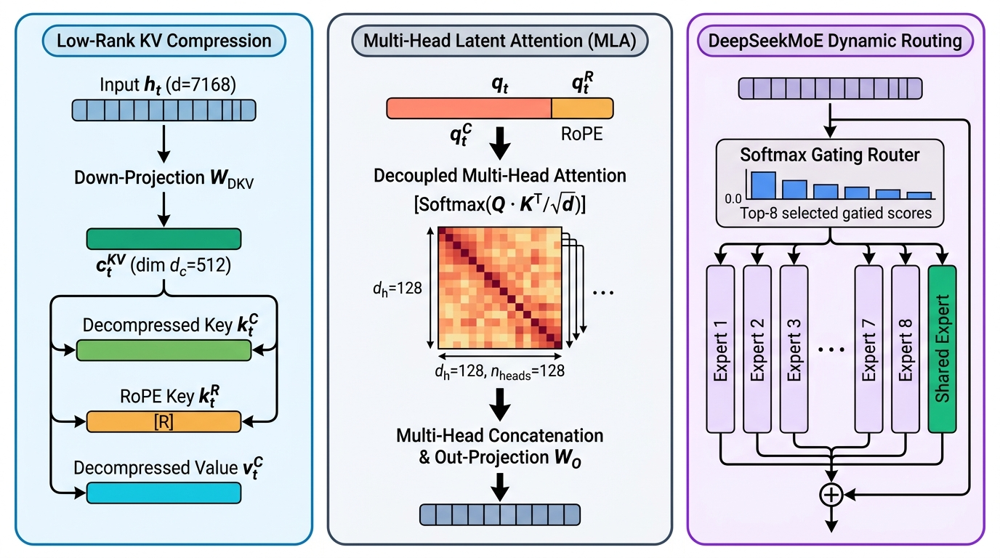
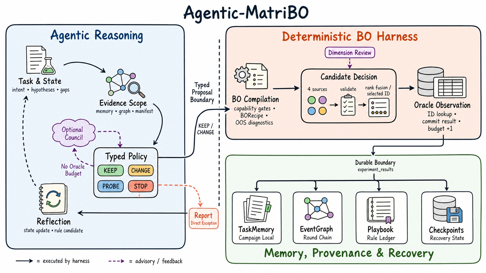
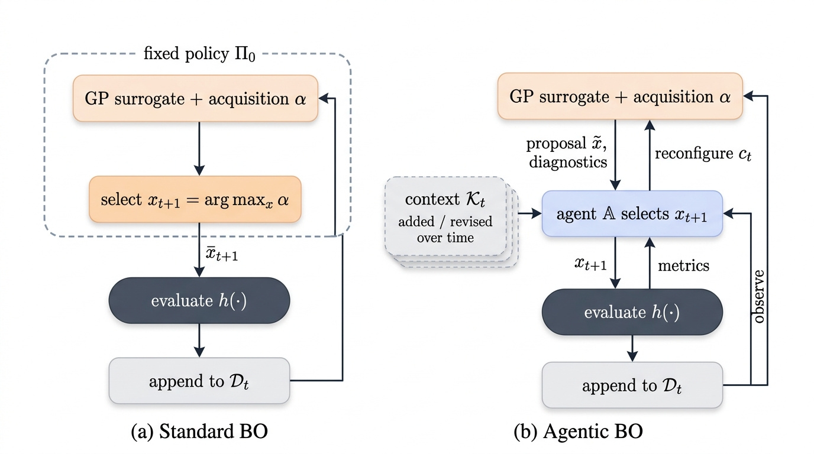
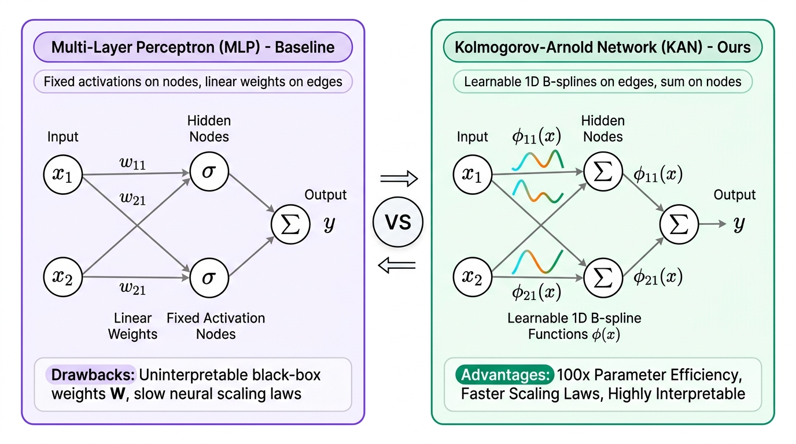
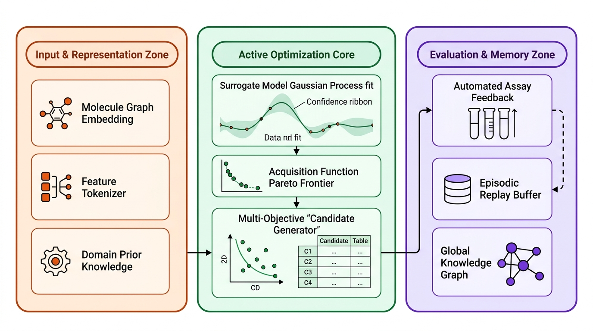
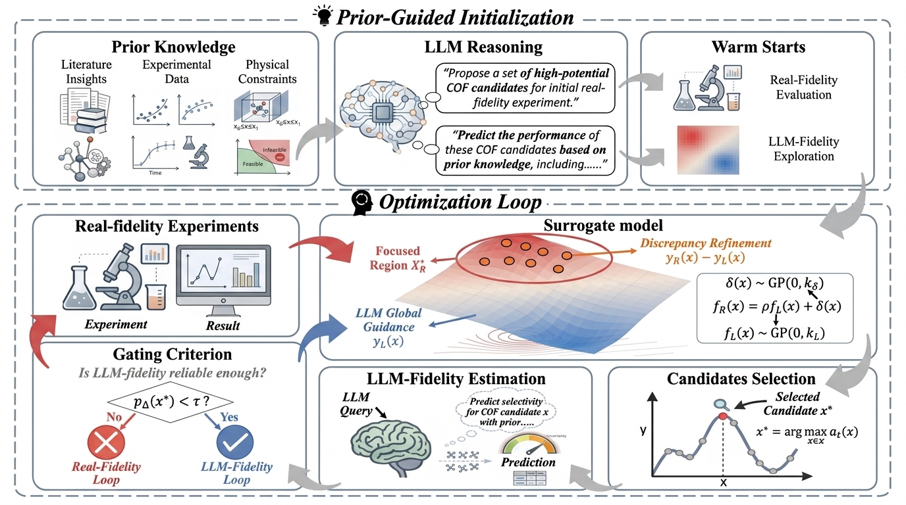

# Academic Figure Skills


**Academic paper figure skills for Claude Code, Cursor, Codex & Gemini CLI.**  
AI 驱动的学术论文配图技能包：看材料 → 第一次出图前选定风格 → 设计并生图 → 对照原图检查。图交出去之后，如果你接受这张图，还可以把里面已有的文字换成 PPT 里的可编辑文本框。

> **是什么？** 2 个可独立安装的 agent skill。`academic-figure-analyzer` 看仓库、论文、草稿和参考图。`academic-figure-workflow` 定风格、写规格、生图、检查，并在你接受成图之后按需把文字做成可编辑 PPT。第一次出图若还没点名风格、也没有要跟随的参考图，会先展示 6 张预览并停下。「直接画」只跳过提示词展示，不代替选风格。三个画面是 `classic-technical`、`pastel-airy-ui`、`illustrated-modular`；`reference-led` 是照着你给的参考图走，不会自动变成手绘风。互不相关的来源或互不相关的图可以分开做；一张图从设计画到检查仍由同一次流程做完。

**2 skills · 3 core style profiles · native Codex rendering · reference-aware revision** · Install: `npx skills add Azhi-ss/academic-figure-skills -g --all`


## 快速开始（30 秒）

```bash
# 全局安装全部技能（推荐）
npx skills add Azhi-ss/academic-figure-skills -g --all
```

然后对 agent 说：

1. `"分析这个仓库再出图。还没定风格就先给我看预览，选定后再画，不用展示 prompt"`
2. `"参考这篇论文 Figure 2 的画法重画我的框架；保留风格，不复制内容"`

先看有哪些 skill（不安装）：

```bash
npx skills add Azhi-ss/academic-figure-skills -l
```

## 构造、诊断与修订画图提示词

直接调用 `academic-figure-workflow`，不另建第二套 prompt 编译器：

| 你可以这样说 | 交付 |
|---|---|
| “根据这些机制构造英文画图 prompt，先不要生图” | 设计简报、完整 prompt、待核实项 |
| “诊断这个 prompt 为什么容易画乱，不改文件” | 问题位置、影响和最小修正建议 |
| “颜色丰富一些，但节点、文字、连线不动，修改 prompt” | 改动与保留清单、完整新 prompt |
| “按照这个 prompt 直接画图，不用返回提示词” | 校验后的内部 prompt、图片和逐版本审核 |

设计顺序是：读者要看懂什么 → 有证据的结构 → 选定风格或参考图 → 再定布局、锚点和文字 → 把每条边写死 → 出图 → 对照原图检查。风格在布局定稿前就定下，不是写完提示词后补一句形容词。已经选过的风格直接沿用，改图时不再弹菜单。箭头画错时只改端点，不把已定的主区和机制行收成一排等大图标。手绘角色、公式卡和微型图都可以用，但不是每个格子都必须有。多 agent 讨论必须来自材料里的真实交互。

具体见 [提示词设计逻辑](academic-figure-workflow/references/prompt-design-logic.md)、[可填充模板](academic-figure-workflow/references/prompt-templates.md) 和 [案例与迁移测试](academic-figure-workflow/references/prompt-design-cases.md)。本次提炼参考 Nuwa 的主题框架方法；成品技能没有 Nuwa 运行时依赖。

### 审核记录与图片正确性分开

新 RenderAudit v2 将记录绑定到实际 image/spec SHA-256，并逐节点、逐边记录 `pass / fail / unverified`。局部修箭头或只调颜色后也重新检查全图；不把旧图的 PASS 移植到新图。

```bash
python3 academic-figure-workflow/scripts/validate_render_audit.py \
  --spec figure.spec.json --image figure.png figure.audit.json
```

返回码：0 是记录完整且全部断言通过；1 是记录有效但未通过验收；2 是记录缺项、版本绑定不符或状态矛盾。它不能看图，不能证明审核者的断言真实；FigureSpec 校验与记录校验都不能代替实际图片目检。旧 v1 审核只保留为历史，新图重新生成 v2 审核。

## 顶会级配图风格全景展示 (Style Showcase Gallery)

本技能包内置多种面向学术论文的标准化配图风格。所有提示词均归一化为**结构化紧凑段落（Compact Prose）**，严禁 Markdown 字符泄漏。默认不在画布顶部重复论文 caption；当用户或参考图明确要求时，可保留一个短小、非横幅式的总标题：

<table>
<tr>
<td align="center" width="50%">

<br/><b>现代前沿技术框线风 (Modern Technical Vector)</b>
<br/><sub><b>对标论文：</b><a href="https://arxiv.org/abs/2412.19437">DeepSeek-V3 (arXiv:2412.19437)</a> Fig 2 MLA & MoE</sub>
<br/><sub><b>核心特征：</b>彩色张量维度条 ($h_t, c_t^{KV}$)、Attention 多层热力图矩阵、Top-K 门控概率柱状图、微米级正交走线</sub>
<br/><sub><a href="docs/prompts/modern_technical_vector_deepseek_mla.spec.json">📄 查看实测 FigureSpec 与提示词</a></sub>
</td>
<td align="center" width="50%">

<br/><b>编辑手绘模块风 (Illustrated Modular)</b>
<br/><sub><b>风格参考：</b><a href="https://arxiv.org/abs/2606.06473">MLEvolve (arXiv:2606.06473)</a> Fig 1–2（仅参考手绘科学信息图语法；架构内容为 Agentic-MatriBO）</sub>
<br/><sub><b>核心特征：</b>奶油白底与深墨蓝手绘描边，蓝/桃/绿三大语义区；左侧 Agentic Reasoning 主区与右侧执行/记忆堆叠区通过实线执行流、紫色虚线建议/反馈和珊瑚 STOP 例外组成可恢复闭环</sub>
<br/><sub><a href="docs/prompts/illustrated_modular_agentic_matribo.spec.json">📄 查看实测 FigureSpec 与提示词</a></sub>
</td>
</tr>
<tr>
<td align="center" width="50%">

<br/><b>现代柔彩空气风 (Pastel Airy UI / Modern Pastel Airy)</b>
<br/><sub><b>对标论文：</b><a href="https://arxiv.org/abs/2608.00316">Brunzema et al. (arXiv:2608.00316)</a> Fig 1 / <a href="https://arxiv.org/abs/2405.15793">SWE-agent (ICML 2024)</a> Fig 2</sub>
<br/><sub><b>核心特征：</b>纯白高留白画布、柔杏数学代理卡片、柔雾冰蓝 Agent 中枢、深灰高对比评估锚点、虚线作用域容器与叠层演进上下文</sub>
<br/><sub><a href="docs/prompts/pastel_airy_ui_agentic_bo.spec.json">📄 查看实测 FigureSpec 与提示词</a></sub>
</td>
<td align="center" width="50%">

<br/><b>对比消融实验风 (Purple-Green Contrast & Ablation)</b>
<br/><sub><b>对标论文：</b><a href="https://arxiv.org/abs/2404.19756">KAN (arXiv:2404.19756)</a> Fig 1 / <a href="https://arxiv.org/abs/2405.14734">SimPO (arXiv:2405.14734)</a> Fig 1</sub>
<br/><sub><b>核心特征：</b>左右高对比分栏、Baseline 固定权重 vs Ours 边上可学习 B-样条非线性曲线 $\phi(x)$ 与节点纯求和 $\sum$</sub>
<br/><sub><a href="docs/prompts/contrast_ablation_kan.spec.json">📄 查看实测 FigureSpec 与提示词</a></sub>
</td>
</tr>
<tr>
<td align="center" width="50%">

<br/><b>有色语义分区图示风 (Paired Semantic Zones)</b>
<br/><sub><b>对标论文：</b><a href="https://arxiv.org/abs/2608.00641">DASH (arXiv:2608.00641)</a> Fig 1 / Agentic-MatriBO Fig 1</sub>
<br/><sub><b>核心特征：</b>蜜桃/薄荷/薰衣草 Paired Tokens、2px 同色暗边框、清晰色区语义绑定与闭环数据流</sub>
<br/><sub><a href="docs/prompts/paired_semantic_zones_dash.spec.json">📄 查看实测 FigureSpec 与提示词</a></sub>
</td>
<td align="center" width="50%">

<br/><b>双保真度引导闭环风 (Dual-Fidelity Loop & Bayesian Optimization)</b>
<br/><sub><b>对标论文：</b><a href="https://arxiv.org/abs/2605.22054">LABO (arXiv:2605.22054)</a> Fig 1 Prior-Guided Initialization & Optimization Loop</sub>
<br/><sub><b>核心特征：</b>上下双宏观容器、双保真度色彩配对（珊瑚红真机实验/残差 vs 板岩蓝大模型代理）、门禁判定菱形 $p_\Delta(x^*) < \tau?$、3D 高斯过程响应曲面与极值搜索闭环</sub>
<br/><sub><a href="docs/prompts/dual_fidelity_loop_labo.spec.json">📄 查看实测 FigureSpec 与提示词</a></sub>
</td>
</tr>
</table>

旧版真实仓库基准覆盖 [stable-diffusion / nanoGPT / ESM / AlphaFold / GraphCast / transformers / CycleGAN / NeRF / DETR / Whisper + sparse fixture](examples/benchmarks/README.md)。它是结构与关键词 smoke test，只检查分析文档的基本形状；**不代表语义正确率，也不是图像质量、风格还原或 RenderAudit 的证据**。

## 技能列表

| 技能 | 功能 | 触发词示例 |
|-----|------|-----------|
| **academic-figure-workflow** | 风格、配色与 prompt 构造/诊断/修订，FigureSpec、原生生图、审图与定向修图；仓库、论文、草稿或参考图先交给 analyzer | 设计论文配图、构造画图提示词、完整论文配图工作流、使用 Codex 生图 |
| **academic-figure-analyzer** | 分析仓库、论文草稿与参考图，产出 SemanticArchitecture@1、FigurePlan@1、ReferenceAnalysis@1；不写 prompt、不生图 | 分析代码仓库、分析草稿配图、提取论文架构图 |

## 完整工作流

你把仓库、论文、链接、参考图，或已经说清的结构交给它。材料需要核对时先分析；结构已经由你说清时直接设计。

第一次出图有一道固定停点：还没点名风格、也没有「就照这张图」的参考时，先看 6 张预览，等你选完再画。你说「直接画」只表示不用看提示词。科学内容还有会改变图意的缺口，或者你要求先看方案时，也会停下来问。

```
材料或你口述的结构
        ↓
需要时先分析
        ↓
第一次出图：看 6 张风格预览，等你选定
（已点名风格，或给出要跟随的参考图，则跳过）
        ↓
写成规格并校验 → 生图
        ↓
对照原图检查 → 最多改两轮
（不把图收成等大图标条）
        ↓
把图交给你，并说明文字可以换成可编辑 PPT
        ↓
你接受这张图并要求之后，才做 PPT 文本框
```

参考图可以交给生图工具。匹配的是构图、笔触、分区、字体和强调方式，不复制原图的文字、拓扑和结论。几张互不相关的图可以分开做；一张图的设计、出图和检查不拆开。

### Codex 直接生成与返修

在 Codex 中，workflow 优先直接调用当前会话暴露的
`image_gen.imagegen`（部分运行时显示为 `image_gen__imagegen`）。`prompt` 只是
内部工具参数；用户说“直接画 / 不要返回 prompt”时，不会把它返给用户复制。

返修对着当前这张图改已看见的问题，不换一套更简单的版式：

1. 以 original detail 查看当前最佳版本并生成绑定 image/spec 哈希的 RenderAudit v2；
2. 将该图作为 `referenced_image_paths` 的第一张图；
3. 只描述已观察缺陷、精确修复与必须保持的正确区域；
4. 保存 `r0/r1/r2` 版本，每次编辑后重新查看与审计；
5. 首图后最多两轮语义返修，瞬态传输重试不占额度。

若密集文字一次定向修复后仍不可靠，就停止重画并说明剩哪些字不对。图交出去之后，若你接受这张图并希望文字能在 PPT 里改，再按 [可编辑 PPT 文字](academic-figure-workflow/references/editable-pptx.md) 盖住旧字、放上文本框。这一步不重新生图，也不改源 PNG。

## 三个 surface profile + reference-led 模式

| profile | 核心视觉特征 | 适用场景 |
|---|---|---|
| **classic-technical** | 精确节点/边、克制线条、明确拓扑；可搭配 Okabe-Ito、蓝调或灰度 | 网络、机制、比较图、印刷约束 |
| **pastel-airy-ui** | 白色或轻色 panel、柔彩 token/pill、较轻的连接与 UI 感 | token flow、界面式系统说明 |
| **illustrated-modular** | 不等大语义区、深色圆润描边、区内开放线稿；子卡只用于真实的一层分组 | agent 系统、AI4Science 闭环、编辑式科学信息图 |
| **reference-led** | 直接保留参考图观察到的构图、表面、笔触与强调语法；可落在前三类任一类或其相干组合 | 用户提供参考图且 preset 不能忠实概括时 |

不知道从哪开始时直接说：

- `帮我从仓库到配图走一遍`
- `完整论文配图工作流`
- `which skill should I use first`

## 安装

### 方式 1：npx skills（推荐）

仓库已公开，`npx skills` 从 GitHub 拉取；**push 到 `main` 即更新分发**，无需 npm publish。

```bash
# 全局安装全部 skill（推荐）
npx skills add Azhi-ss/academic-figure-skills -g --all

# 仅列出仓库内 skill（不安装）
npx skills add Azhi-ss/academic-figure-skills -l

# 只装其中一个
npx skills add Azhi-ss/academic-figure-skills -g -s academic-figure-workflow -y

# 更新到 main 最新
npx skills update Azhi-ss/academic-figure-skills -g -y

# 查看已安装
npx skills list -g
```

也可用完整 URL：

```bash
npx skills add https://github.com/Azhi-ss/academic-figure-skills -g --all
```

发现页（skills.sh）：搜索 `academic-figure-skills` 或 owner `azhi-ss`。

### 方式 2：手动（开发调试）

```bash
git clone https://github.com/Azhi-ss/academic-figure-skills.git
# 将各个 skill 目录链到 agent skills 路径，例如：
# ln -s "$PWD/academic-figure-workflow" ~/.claude/skills/academic-figure-workflow
```

更推荐始终用 `npx skills add`，避免把整个 monorepo 误拷进 skills 目录。

## 从 3.x 升级

旧的 `academic-figure-designer`、`academic-repo-analyzer`、`academic-figure-draft-analyzer`、`academic-figure-architecture-extractor` 已并入 workflow 与 analyzer。先卸掉旧 skill，再安装当前包：

```bash
npx skills remove --global academic-figure-designer academic-repo-analyzer academic-figure-draft-analyzer academic-figure-architecture-extractor
npx skills add Azhi-ss/academic-figure-skills -g --all
```

## 使用示例

```
# 场景 1: 从代码仓库出图
You: 分析这个仓库并直接生图，不要展示 prompt
AI:  [先看仓库 → 若你还没选风格，展示 6 张预览并停下
      → 你选定后写规格、校验、生图、对照原图检查
      → 把图交给你，并说明可以换成可编辑 PPT 文字]
```

```
# 场景 2: 用论文图作风格参考
You: 参考这个 arXiv 页面 Figure 2 的画法，重画我的框架，不复制内容
AI:  [解析论文 URL 与原图 → ReferenceAnalysis v1 → style grammar
      → reference-conditioned generation]
```

```
# 场景 3: 基于首图做定向修订
You: 保持布局，只修复乱码、透明背景和多余节点
AI:  [view_image(original) → RenderAudit v2 → 当前最佳图作第一引用
      → targeted image edit → 再审计；最多两轮]
```

## 风格 profile 与配色变量

单一事实源：[`academic-figure-workflow/references/styles/`](academic-figure-workflow/references/styles/) 与 [`academic-figure-workflow/references/palettes.md`](academic-figure-workflow/references/palettes.md)。[`docs/styles.md`](docs/styles.md) 仍是风格总览。

内置样式文件可以提供更细的变体；workflow 先选择三个 surface profile，必要时再启用 `reference-led` 覆盖模式：

| profile | 何时用 | 核心表现 | 对标代表论文 |
|--------|--------|---------|---|
| **classic-technical**<br>*(现代前沿技术框线风 / Modern Technical Vector)* | 深度学习大模型架构、算法张量流、精确技术拓扑与顶会工程架构 | 彩色张量条、多层注意力热力图、门控概率柱状图、正交微米走线 | **DeepSeek-V3** (2024) Fig 2<br>**DiT** (ICCV 2023) Fig 2<br>**Mamba** (ICML 2024) Fig 1 |
| **illustrated-modular** | 科学工作流、AI4Science、多智能体闭环、需要图示化叙事 | 不等大色区、区内开放线稿和短机制行、手绘标题；子卡只框真实的一层分组 | **MLEvolve** (2026) Fig 1–2（风格参考）<br>**Agentic-MatriBO** Fig 1 |
| **pastel-airy-ui** | LLM Token 流、Agent 交互界面、概念决策循环 | 纯白浮动卡片、CLI 终端仿真视窗、悬浮柔彩 Token/Pill、高留白比率 | **SWE-agent** (ICML 2024) Fig 2<br>**ReAct** (ICLR 2023) Fig 1<br>**Reflexion** (NeurIPS 2023) Fig 1 |
| **reference-led** | 用户给出参考图且其语法不应被 preset 覆盖 | 如实继承观察到的 surface/composition，不自动转成手绘柔彩 | 用户提供的任意顶刊/顶会论文原图 |

内容关系、用户偏好、参考图、可访问性与黑白印刷配方见 [`academic-figure-workflow/references/palettes.md`](academic-figure-workflow/references/palettes.md) 的 **Scene → palette decision** 与 **Worked decision recipes**。venue/domain 名称本身不选择颜色。

| 经典配色方案 | 适用场景 |
|-----|---------|
| Okabe-Ito | 默认分类色起点；需结合形状/线型并按实际背景验证 |
| Nature Blue | 需要单色层级、打印稳定或用户明确偏好时 |
| Blue Monochrome | 模块详解、灰度友好 |
| Warm Earth | 用户/参考明确要求的暖土色语法 |
| Purple-Green | 两类对比或消融；不得默认某色代表 ours |
| Grayscale | 纯灰度 |
| Teal-Coral | 用户/参考明确要求的两类冷暖对比 |
| ML TopConf Tab10 | 对齐 Matplotlib 实验色 |
| ML TopConf Colorblind | colorblind-aware 起点，仍需双重编码与实图校验 |
| ML TopConf Deep | 多面板消融 |
| Print-Safe Gray | 严格黑白印刷 |
| Journal Standard | 经验证确需较多类别色的图；不由期刊名触发 |

决策顺序：`用户要求 → 参考图 style grammar → 生产约束 → 语义角色 → 安全默认`。模块数量本身不触发某个色板。

## 文档与资源

| 文档 | 说明 |
|-----|------|
| **[academic-figure-workflow/references/palettes.md](academic-figure-workflow/references/palettes.md)** | 12 套经典 preset、I1 paired semantic tokens 与四种路由模式 |
| **[docs/styles.md](docs/styles.md)** | 风格总览；定义文件在 workflow 的 `references/styles/` |
| **[academic-figure-workflow/references/codex-image-workflow.md](academic-figure-workflow/references/codex-image-workflow.md)** | Codex 原生生成、参考图编辑与安全调用 |
| **[academic-figure-workflow/references/render-audit.md](academic-figure-workflow/references/render-audit.md)** | RenderAudit v2：图片/spec 绑定、逐边检查与定向修订 |
| **[academic-figure-analyzer/references/missing-info-policy.md](academic-figure-analyzer/references/missing-info-policy.md)** | 缺信息时的统一策略 |
| **[CHANGELOG.md](CHANGELOG.md)** | 版本历史 |
| **[CONTRIBUTING.md](CONTRIBUTING.md)** | 贡献指南 |
| **[docs/academic-references.md](docs/academic-references.md)** | 学术引用 |
| **[academic-figure-workflow/references/editable-pptx.md](academic-figure-workflow/references/editable-pptx.md)** | 接受成图后，把已有文字换成 PPT 文本框 |
| **[docs/best-practices.md](docs/best-practices.md)** | 参考驱动、可读性与生成后审计实践 |
| **[examples/](examples/)** | 端到端 handoff 示例 |

## 常见问题 FAQ

### Q: 生成的是英文还是中文？
A: 给图片模型的 JSON / prompt 用英文；对用户的说明可用中文。

### Q: 默认 JSON 还是纯文本 prompt？
A: 所有路径都先形成可校验的 FigureSpec/渲染包；`classic-technical` 的拓扑约束更强，`pastel-airy-ui` 和 `illustrated-modular` 额外描述 surface/illustration grammar。prompt 是内部渲染输入，只有用户明确索要时才展示；出图后仍必须执行 RenderAudit。

### Q: 三个风格 profile 怎么选？
A: 精确拓扑用 `classic-technical`；轻量 token/card 叙事用 `pastel-airy-ui`；agent-drawn、柔彩语义分区用 `illustrated-modular`。有参考图时先分析其真实语法；只有 preset 无法忠实概括时才用 `reference-led`，且不会自动变成 illustrated modular。

### Q: 可以直接用 Codex 生图而不看 prompt 吗？
A: 可以跳过 prompt 展示。明确说“直接生成 / 不展示 prompt / 使用本地模型”即可 waive prompt review。若这次请求没有点名风格、也没有给出要跟随的参考图，workflow 会先展示 6 张风格预览并停下，不调用生图。正式生成前仍会运行 render-ready 校验；缺 `style_selection` 或值为 `pending` 时不能出图。

### Q: 必须按顺序跑完整流水线吗？
A: 不需要。不必跑完整流水线，可只做分析（analyzer）或只做设计/prompt/生图（workflow）。

### Q: 4.2.0 有什么变化？
A: 可编辑 PPT 文字并进 workflow，但不是出图的必经步骤。图交出去时会告知文字可以换成 PPT 文本框；用户接受这张图并要求之后才做。源 PNG 不改，也不再单独安装一个 skill。

### Q: 4.1.0 有什么变化？
A: 第一次出图前，没指定风格时必须先看 6 张预览并等用户选择。「直接画」只跳过 prompt 展示，不代替选风格。修图、已点名风格或有参考图时不再弹菜单。

### Q: 4.0.0 有什么变化？
A: 4.0.0 是结构合并、行为不变：原先 5 个 skill 并入 workflow 与 analyzer。3.3.0 的校验仍然有效：FigureSpec 校验器直接读取 `figure-spec.schema.json`；workflow 自带校验器与元数据清理脚本，单独安装也能完成 render-ready 校验和交付前清理。可先构造、诊断或修订 prompt，也可直接调用 Codex `image_gen.imagegen`；生成遵守 prompt-review/hash 与可信工作区校验，每张新图执行 RenderAudit v2，最多两次定向编辑。未版本化旧 spec 与风格别名不再被接受，`--strict-v1` 保留但已不起作用。

## 引用

如果本技能包帮助了你的工作，可以这样引用：

```bibtex
@software{academic-figure-skills,
  author = {Azhi-ss},
  title = {Academic Figure Skills: AI-powered academic figure generation skill pack},
  year = {2026},
  url = {https://github.com/Azhi-ss/academic-figure-skills},
  version = {4.2.0}
}
```

## 许可证

MIT License

## 致谢

本项目受到 [LINUX DO](https://linux.do/) 社区的启发和支持。
